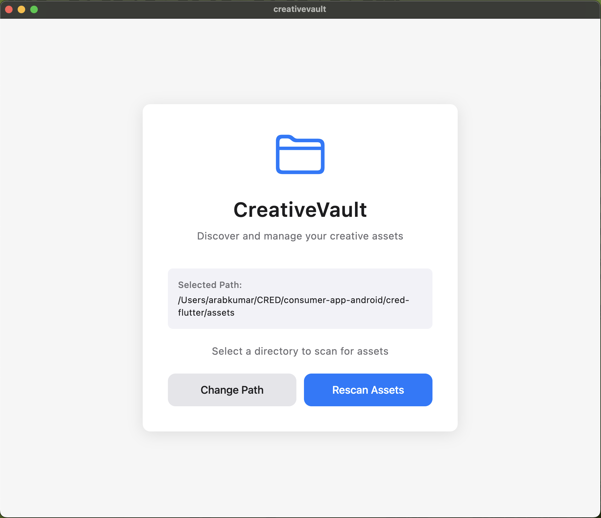
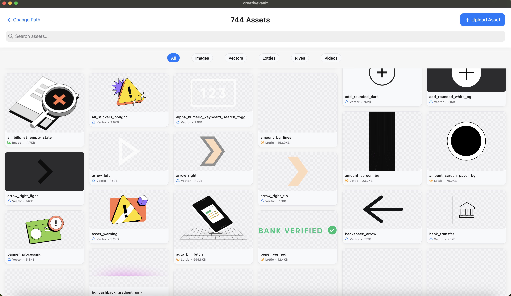
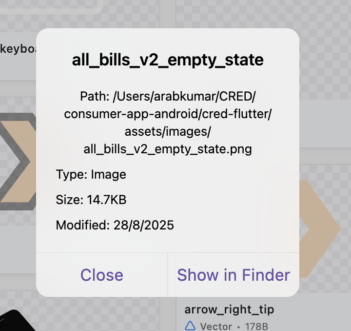

# 🎨 CreativeVault

<div align="center">


**Discover and manage your creative assets with intelligent similarity detection**

[Features](#-features) • [Screenshots](#-screenshots) • [Installation](#-installation) • [Usage](#-usage) • [Architecture](#-architecture) • [Contributing](#-contributing)

</div>

---

## 🌟 Overview

CreativeVault is a powerful macOS application built with Flutter that helps creative professionals and developers discover, organize, and manage their digital assets. Whether you're working with images, vectors, animations, or videos, CreativeVault uses advanced similarity detection algorithms to help you find duplicate and similar assets across your projects.

## ✨ Features

### 🔍 **Intelligent Asset Discovery**
- **Multi-format Support**: Images (PNG, JPG, JPEG, WebP), SVGs, Lottie animations, Rive files, and videos
- **Smart Scanning**: Recursively scans directories to discover all supported assets
- **Real-time Progress**: Live scanning progress with asset count updates

### 🧠 **Advanced Similarity Detection**
- **Visual Similarity**: Histogram-based image comparison for accurate visual matching
- **Exact Duplicates**: SHA-256 hash comparison for identical file detection
- **Similarity Scoring**: Percentage-based similarity scores with configurable thresholds
- **Multiple Match Types**: Exact matches, near duplicates, and visually similar assets

### 🎯 **Smart Asset Management**
- **Upload & Compare**: Upload new assets and instantly find similar ones in your collection
- **Filter by Type**: Filter assets by type (Images, Vectors, Lotties, Rives, Videos)
- **Search Functionality**: Quick search through asset names
- **Asset Details**: View comprehensive asset information including size, format, and modification date

### 🎨 **Beautiful macOS UI**
- **Native Design**: Cupertino design language optimized for macOS
- **Masonry Grid**: Responsive grid layout that adapts to different screen sizes
- **Smooth Animations**: Fluid transitions and loading states
- **Dark/Light Theme**: Adaptive theming that follows system preferences

### 🚀 **Performance Optimized**
- **Streaming Processing**: Process large asset collections without memory issues
- **Caching**: Smart caching of thumbnails and metadata
- **Background Processing**: Non-blocking UI during asset scanning and comparison

## 📱 Screenshots

<div align="center">

### Path Selection Screen


### Asset Gallery with Similarity Results


### Asset Details Modal


</div>

## 🛠 Installation

### Prerequisites

- **Flutter SDK**: 3.10.0 or higher
- **Dart SDK**: 3.0.0 or higher
- **macOS**: 10.14 or higher
- **Xcode**: 12.0 or higher (for iOS/macOS development)

### Setup Instructions

1. **Clone the repository**
   ```bash
   git clone https://github.com/your-username/creativevault.git
   cd creativevault
   ```

2. **Install dependencies**
   ```bash
   flutter pub get
   ```

3. **Run the application**
   ```bash
   flutter run -d macos
   ```

4. **Build for production**
   ```bash
   flutter build macos --release
   ```

## 🚀 Usage

### Getting Started

1. **Launch CreativeVault** and click "Choose Path" to select a directory containing your creative assets
2. **Wait for scanning** to complete - the app will automatically discover all supported assets
3. **Browse your assets** using the responsive grid layout and filter by type
4. **Upload new assets** using the "Upload Asset" button to find similar ones in your collection
5. **View similarity results** with exact matches and similar assets clearly categorized

### Key Features

- **Path Selection**: Choose any directory to scan for assets
- **Asset Filtering**: Filter by asset type using the filter chips
- **Search**: Use the search bar to find specific assets by name
- **Similarity Detection**: Upload assets to find duplicates and similar content
- **Asset Details**: Click any asset to view detailed information and open in Finder

## 🏗 Architecture

CreativeVault follows a clean architecture pattern with clear separation of concerns:

### Core Layer
- **Models**: `AssetModel`, `SimilarityResult`, `AppState`
- **Contracts**: Abstract interfaces for dependency injection
- **Services**: Business logic and orchestration

### Infrastructure Layer
- **Asset Scanner**: Directory scanning and asset discovery
- **File Manager**: File system operations and permissions
- **Similarity Detector**: Image comparison and similarity algorithms

### Presentation Layer
- **Screens**: UI screens and navigation
- **Widgets**: Reusable UI components
- **Controllers**: State management with Riverpod

### Key Dependencies

```yaml
dependencies:
  flutter_riverpod: ^2.5.1          # State management
  file_picker: ^8.1.2               # File selection
  image: ^4.2.0                     # Image processing
  crypto: ^3.0.3                    # Hashing algorithms
  flutter_staggered_grid_view: ^0.7.0  # Grid layout
  video_player: ^2.9.1              # Video preview
  rive: ^0.13.13                    # Rive animation support
  lottie: ^3.1.2                    # Lottie animation support
```

## 🔧 Configuration

### Similarity Thresholds
The app uses configurable similarity thresholds:
- **Exact Match**: 95%+ similarity (identical files)
- **Near Duplicate**: 80-95% similarity (very similar)
- **Visually Similar**: 60-80% similarity (similar content)

### Supported File Types
- **Images**: PNG, JPG, JPEG, WebP
- **Vectors**: SVG
- **Animations**: Lottie (JSON), Rive (RIV)
- **Videos**: MP4, MOV, AVI, MKV, WebM

## 🤝 Contributing

We welcome contributions to CreativeVault! Here's how you can help:

### Development Setup

1. Fork the repository
2. Create a feature branch: `git checkout -b feature/amazing-feature`
3. Make your changes and add tests if applicable
4. Commit your changes: `git commit -m 'Add amazing feature'`
5. Push to the branch: `git push origin feature/amazing-feature`
6. Open a Pull Request

### Code Style

- Follow the existing code style and patterns
- Use meaningful variable and function names
- Add comments for complex logic
- Ensure all tests pass before submitting

### Reporting Issues

- Use the GitHub issue tracker
- Provide detailed reproduction steps
- Include system information and error logs
- Use appropriate labels for issue categorization

## 📄 License

This project is licensed under the MIT License - see the [LICENSE](LICENSE) file for details.

## 🙏 Acknowledgments

- **Flutter Team** for the amazing cross-platform framework
- **Riverpod** for excellent state management
- **macOS Design Guidelines** for UI/UX inspiration
- **Open Source Community** for the various packages used

## 📞 Support

- **Documentation**: [Wiki](https://github.com/your-username/creativevault/wiki)
- **Issues**: [GitHub Issues](https://github.com/your-username/creativevault/issues)
- **Discussions**: [GitHub Discussions](https://github.com/your-username/creativevault/discussions)

---

<div align="center">

**Made with ❤️ for the creative community**

[⭐ Star this repo](https://github.com/your-username/creativevault) • [🐛 Report Bug](https://github.com/your-username/creativevault/issues) • [💡 Request Feature](https://github.com/your-username/creativevault/issues)

</div>